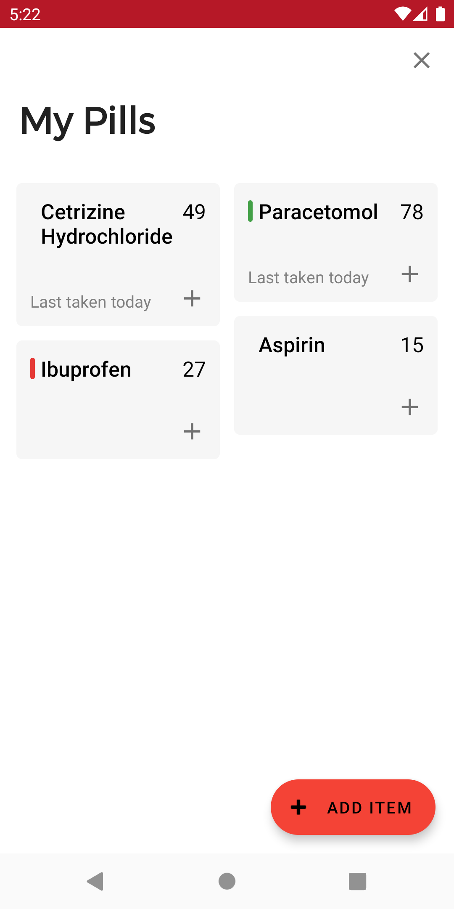
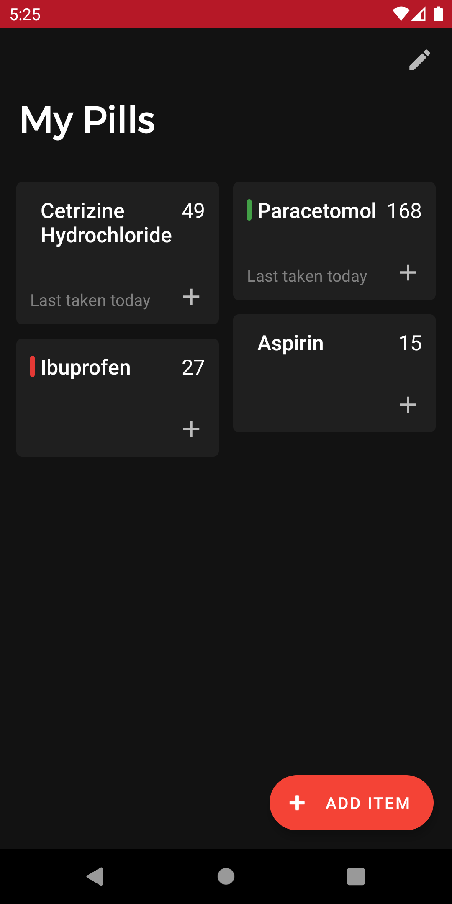
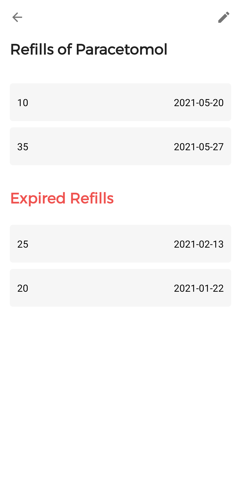
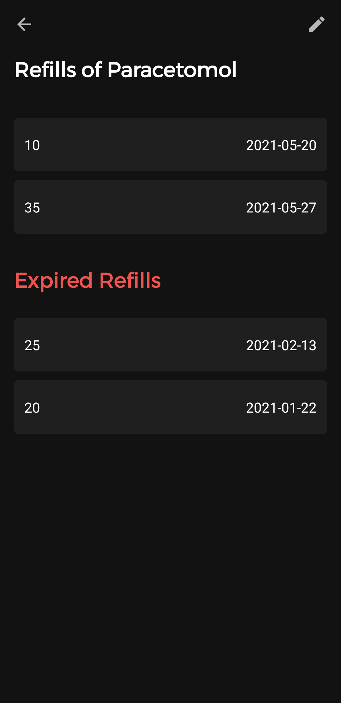

# PillBox 
## By Isaac Young

### PillBox is an android app which helps you to manage your pills and medication

  
  
  
  

 

Keep track of all your pills so you don't run out unexpectedly.

<b>Simple and easy to use</b>

Everything you do most often is right at your fingertips, so nothing is more than a couple clicks away.

<b>Homescreen Widget</b> 

A handy homescreen widget allows you to check off an item right from the homescreen. You can choose which items are displayed on the homescreen for privacy. 

<b>Personalizable</b>

Reorder items however you want. 

<b>Coming Soon</b> 

- Color code items to quickly get to the ones you need. 
- Expiration date 

For Harley

