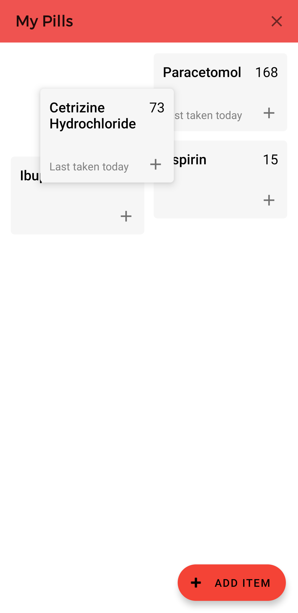
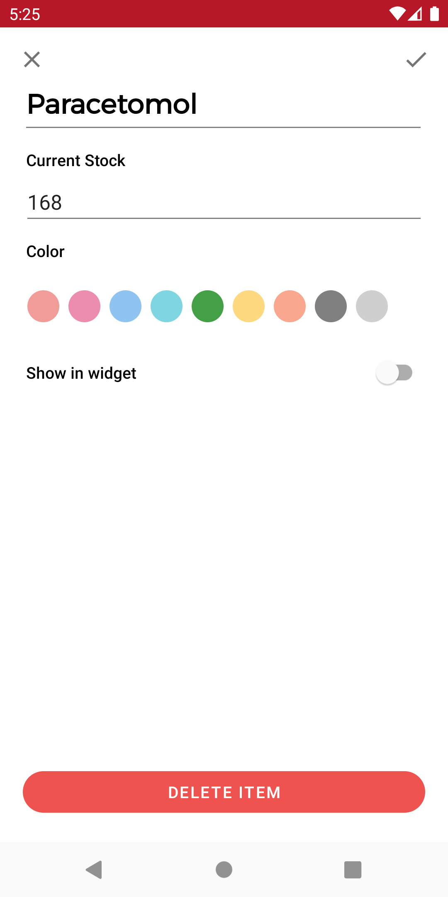
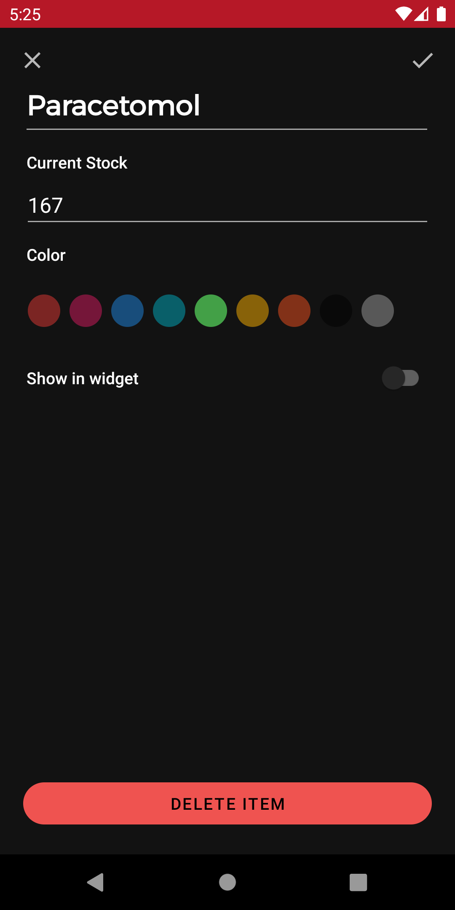
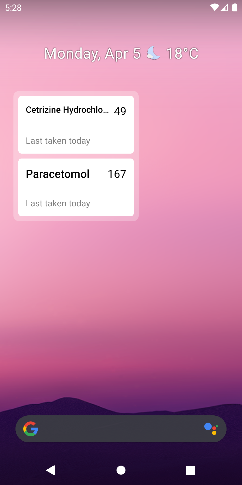

# Pillbox 
## By Isaac Young

### Pillbox is an android app which helps you to manage your pills and medication

  
  
  
  
  
  
  
  
  
 

Keep track of all your pills so you don't run out unexpectedly.

<b>Simple and easy to use</b>

Everything you do most often is right at your fingertips, so nothing is more than a couple clicks away.

<b>Homescreen Widget</b> 

A handy homescreen widget allows you to check off an item with one click, right from the homescreen. You can choose which items are displayed on the homescreen for privacy. 

<b>Track your refills</b>

Track when you refill your pills, along with the expiry date, so Pillbox can warn you when they're about to expire.

<b>Personalizable</b>

Categorize your pills by color, or reorder them.

<b>Features</b>

- Add, edit, rearrange and delete your stock of items
- Tap to decrement stock
- Homescreen widget with 1-tap decrement of stock
- Choose which items are displayed on the homescreen widget
- Clean and modern UI
- Dark mode
- Color code items to quickly find the ones you need 
- Record expiry date of individual refills of items

For Harley

